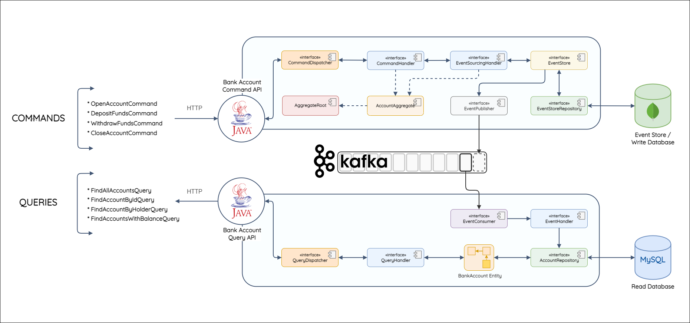

# Bank API with Kafka

A Bank API implements with Event-Sourcing and the CQRS pattern, supported by [Apache Kafka](https://kafka.apache.org/) for event-streaming. This project's used for demonstration only.



## CQRS

CQRS stands for Command and Query Responsibility, a pattern that separates read and update operations. This pattern provides more flexibity and performance to a certain types of systems.

In a traditional architecture, especially Monolith, which handles both read and write at the same time and it causes a huge burden to the server and database. CQRS helps separating the read and write operations individually.

## Event Sourcing

Event Sourcing is part of the CQRS pattern, it acts as a notebook or you might say it captures all the histories related to a specific cases.

Its specialty is help restoring the data into its fullest state.

## Usage

Before using this project, you must have these requirements:
- Install [IntelliJ](https://www.jetbrains.com/idea/)
- Install [Docker](https://www.docker.com/)
- Install [Java JDK](https://www.oracle.com/java/technologies/downloads/) (This project currently uses Java18)

Clone this project:

```bash
$ git clone https://github.com/shelldog/event-driven-tech-bank.git
```

Run the utilities with Docker:

```bash
$ docker-compose -f docker-compose.yaml
```

Open the project with IntelliJ and run as usual

## Stack

- Backend framework: Spring Boot.
- Database: MySQL, MongoDB.
- Kafka for streaming.